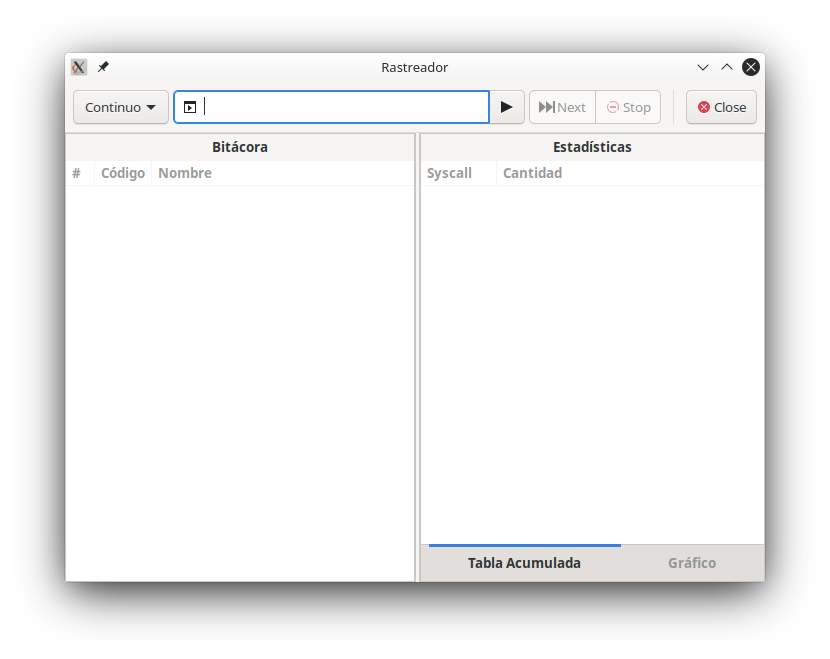
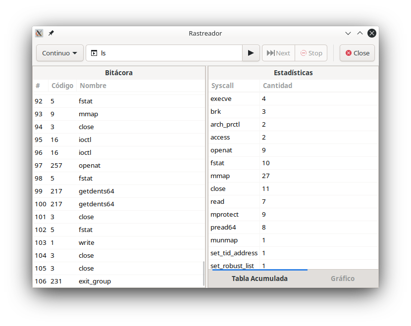
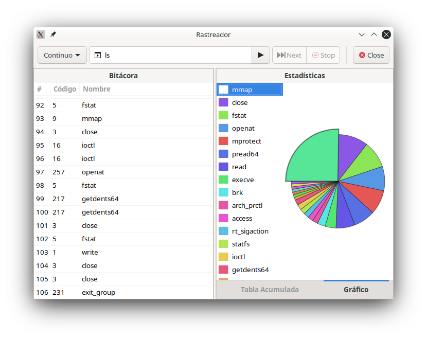

# Rastreador de Syscalls
Proyecto 0 de IC6600 Principios de Sistemas Operativos

Un rastreador de system calls para Linux escrito en C y con interfaz gráfica de Gtk.

## Cómo compilar
Compile el proyecto usando GNU Make
```
$ make
```
### Requisitos
- GNU Make
- GCC
- libgtk-3-dev

## Cómo usar
Una vez compilado, corra el programa desde una línea de comandos.
```
$ ./rastreador
```


Ingrese un comando en el campo de texto en la parte superior de la ventana y presione el botón de play para ejecutarlo.
Alternativamente, puede ingresar el comando directamente desde la terminal.
```
$ ./rastreador [comando]
```

Con el combobox a la izquierda puede escoger si quiere correr el programa en modo continuo o pausado.

Si se ejecuta en modo pausado, utilice el botón 'Next' para continuar la ejecución después de cada system call.
En cualquier momento durante la ejecución, puede presionar el botón 'Stop' para matar el proceso que se está rastreando.



En el lado izquierdo de la ventana se encuentra la bitácora.
En el lado derecho de la ventana se encuentran las estadísticas del programa.
Por defecto se muestra la tabla acumulada con la cantidad de invocaciones de cada tipo de system call.



Una vez que finalice la ejecución de su programa, puede hacer clic en la pestaña 'Gráfico'
que se encuentra debajo de la tabla para mostrar los datos en un gráfico de pastel.

## Características no implementadas
- Descripción de los system calls

## Otras notas
- Solo se ha probado en arquitectura x86_64
